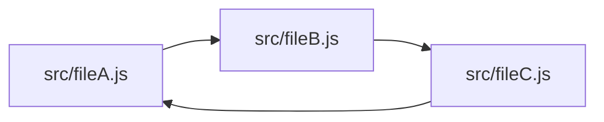

	

**skott** is a minimalist developer tool that can be used to efficiently generate directed graphs from your JavaScript/Node.js project. It can automatically collect metadata, detect circular dependencies and can be used to implement affected/incremental patterns as it exposes a way to know precisely dependencies for each graph node.

_Graph Construction_
**skott** is powered by [digraph-js](https://github.com/antoine-coulon/digraph-js), a _0 dependency_ Node.js library to make Directed Graph construction and traversal effortless.

> **Note**
>
> **skott** goal is to represent all the file tree structure but was designed to only include dependencies currently being used in the project based on the entrypoint. Consequently unused files (files that are not imported/exported by any other file) won't be included in the graph structure.

✅ Works for **JavaScript/Node.js** projects (ECMAScript and CommonJS modules). Dynamic imports for ECMAScript are also tracked.

✅ Deeply detects **circular dependencies** in an efficient way, with the ability to provide a max depth for the search

✅ Deeply **collect all dependencies of the project graph**

✅ Deep **parent and child dependencies traversals**

✅ Metadata collection for each traversed node (file size, view dependencies towards Node.js builtin modules and npm third-party libraries)

✅ Node.js binary and JSON modules are excluded by default

✅ Generate [mermaid-js](https://github.com/mermaid-js/mermaid) diagrams (.svg, .png, .md) representing your project's graph directly from the CLI.

Work in progress includes:

🛠 Flag unused imports/exports and potentially prune them

🛠 Explore automatic cyclic dependencies prune 

🛠 Resolve workspaces/monorepos graphs

## Why you should care about circular dependencies and dead code

1. **Circular (also known as cyclic) dependencies**

Let's start with an example of a simple circular dependency between three graph nodes:
> In the context of **skott**, nodes represent JavaScript files.

**What is the problem with cycles?**

Circular dependencies can make your program crash or introduce inconsistencies while modules are being loaded. [Node.js module systems](https://nodejs.org/api/modules.html) try to resolve circular dependencies using different approaches which are more or less successful. For example, [CommonJS](https://nodejs.org/api/modules.html#modules-commonjs-modules) can (due to its dynamic nature of resolving imports) [introduce inconsistencies when building the project graph](https://nodejs.org/api/modules.html#cycles).

If you're using [ECMAScript modules](https://nodejs.org/api/esm.html), you can consider yourself safe about module resolution inconsistencies mentioned above, mostly thanks to its static nature.

Nevertheless, cyclic dependencies at the file-level are sometimes choices but more often [code smells](https://en.wikipedia.org/wiki/Code_smell) revealing design misconceptions, so be sure to double check that.

2. **Dead code**

_Dead code_ can be defined as a code literally having no impact on the application, meaning that removing dead code should not alter in any way the behavior of the system. Some module bundlers such as [Rollup](https://rollupjs.org) and [Webpack](https://webpack.js.org) allow to delete some of the dead code [leveraging tree shaking](https://webpack.js.org/guides/tree-shaking). 

However, tree shaking is not an easy task and can mostly work with module systems using static-based imports/exports such as ECMAScript modules. To avoid removing code that appears to be used at runtime, module bundlers are being very precise about determining automatically chunks of code that can be safely removed. Module bundlers can also be helped by providing them manually clues about what can be safely removed e.g. `/*#__PURE__*/` for Webpack.

If you're not using tools implementing tree shaking, you will be able soon to use **skott**, which will bring up soon unused imports/exports warnings 🚀  

## Documentation

Please refer to the [documentation at the skott package level](https://github.com/antoine-coulon/skott/tree/main/packages/skott#readme)