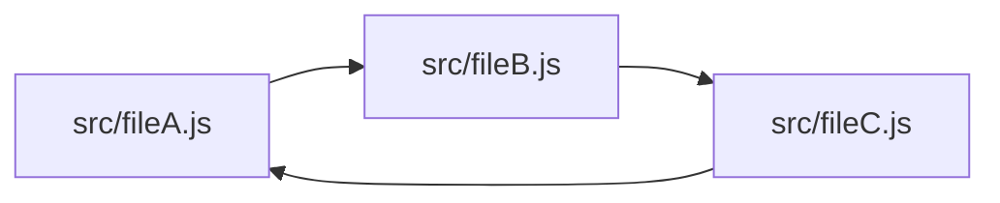

<p align="center">
	
</p>


[](https://www.npmjs.com/package/skott)
[](https://github.com/antoine-coulon/skott/commit-activity)
[](https://opensource.org/licenses/MIT)


**skott** is a minimalist developer tool that can be used to efficiently generate directed graphs from your **JavaScript/TypeScript/Node.js** project. It can **automatically collect metadata** such as _file size_, _third-party_ or _builtin dependencies_, **detect circular dependencies**, **finding unused npm dependencies**, help you **building tools relying on graph data structures** thanks to the exposed primitives. Many display modes exists (such as **embedded interactive web application** shown just below) but also other from the CLI (file-tree, graph). Static files **(.svg, .png, .md, .json)** can also be generated.

<p align="center">
	
</p>

**skott** exposes **directed graphs primitives** so that it can be used to implement tools on top of graph structures e.g. affected/incremental patterns as it exposes a way to know precisely and deeply dependencies for each graph node. More generally speaking, anything that can be implemented using graphs can be implemented using **skott**.

✅ Works for modern **JavaScript/TypeScript** projects (TSX/JSX, ECMAScript and CommonJS modules all supported). **TypeScript**'s path aliases are also supported.

✅ Deeply detects **circular dependencies** in an efficient way, with the ability to provide a max depth for the search

✅ Detect **unused source code files**. Eliminate dead code by finding files not imported anywhere else in the graph.

✅ Detect **unused npm third-party dependencies**. Note that all unused `devDependencies` are not guaranteed to be detected as `depcheck` [only provides analysis for set of supported libraries](https://github.com/depcheck/depcheck) (eslint, karma, mocha, etc).

✅ Many **builtin visualization modes** including a web application or terminal-based outputs such as file-tree or graph views. Visualization modes can be rendered using both the CLI and programatically using the API.

✅ Builtin **watch mode** updating the graph when file changes are detected. It works with all display modes (webapp and all CLIs visualization modes). Support all options of file ignoring/filtering from skott.

✅ File tree traversal supports **ignore patterns** and **Git ignored files** (via `.gitignore` files)

✅ Runs **incrementally** (experimental), meaning that skott will _only analyze_ files that were modified/added since the last run, offering performance boosts.

✅ Works with any custom **dependency resolver** (useful for specific monorepos integration where module identifiers need to be mapped to a specific workspace package) 

✅ Deeply **collect all dependencies of the project graph**, including third-party and builtin.

✅ Graph API including deep **parent and child dependencies traversals** using DFS and BFS algorithms.

✅ Metadata collection per traversed node (file size, dependencies)

✅ Generate static files including raw JSON, [mermaid-js](https://github.com/mermaid-js/mermaid) diagrams (.svg, .png, .md) representing your project's graph directly generated from the CLI.

`skott` can be used either via its CLI or JavaScript API. It can either build the project graph using an entrypoint file or build it starting from the current root directory and recursively traverse all directories/folders. Currently, supported files are **.js, .jsx, .cjs, .mjs, .ts, .tsx**. **skott does not rely on module systems for path resolution**, it will resolve `require/import` no matter the configuration.

## Getting started

This is a quick start, **please check the [complete documentation at the skott package level](https://github.com/antoine-coulon/skott/tree/main/packages/skott#readme)** to see more. There are also some **[examples available there](https://github.com/antoine-coulon/skott/blob/main/packages/skott/examples/api.ts)**.

Install `skott` from npm using whatever package manager you like:

```sh
<insert-your-package-manager> install skott
```

Let's see examples of an analysis that will traverse all files (minus the ignored ones via the ignorePatterns + .gitignore) starting from the current working directory.

**Using the CLI**

```sh
skott --displayMode=webapp --trackThirdPartyDependencies --ignorePattern="test/**/*"
```

**Using the API**

```js
import skott from "skott";

const { getStructure, getWorkspace, findUnusedDependencies, useGraph } = await skott({
    ignorePatterns: ["test/**/*"],
    dependencyTracking: {
        builtin: false,
        thirdParty: true,
        typeOnly: true
    }
});

// Do whatever you want with the generated graph
const { graph, files } = getStructure();
const workspace = getWorkspace();
const unusedDependencies = await findUnusedDependencies();
const { findCircularDependencies, collectFilesDependencies, ...traversalApi } = useGraph();
```

**Note**: the API is currently published as ESM only.

Because the graph can become heavy on large codebases, you also have the ability to reduce the scope of the analysis:

**Specificying a sub-folder**

```sh
skott --cwd=packages/skott 
```

or 

```js
import skott from "skott";

const api = await skott({
    cwd: "packages/skott"
});
```

**Specifying an entrypoint**

This will strictly traverse the graph starting from the provided entrypoint, discarding all other files not part of that graph.

```sh
skott packages/skott/index.ts
```

or

```js
import skott from "skott";

const api = await skott({
    entrypoint: "packages/skott/index.ts"
});
```

## Why you should use skott or an equivalent project

The whole purpose of skott is to build a graph from your project source code and offer many features relying on that generated graph.

Overall, a generated project graph in software engineering acts as a **powerful tool that enhances code comprehension, project management, code maintenance and refactoring, and collaboration**. It provides a holistic view of the project's structure, dependencies, and relationships, enabling developers to make informed decisions and streamline their development process.

Moreover, skott aims to provide a comprehensive visual representation of the project's structure, dependencies, and relationships between different components. This visual overview **allows developers to better understand the overall architecture and organization of the codebase, making it easier to navigate and identify potential areas of improvement or optimization**. 

In the essence the main goal of skott is to **help developers understand the codebase's structure and to enable more effective refactoring, reducing code duplication, getting rid of circular dependencies and improving overall code quality**.

## Why you should care about circular dependencies and dead code

1. **Circular (also known as cyclic) dependencies**

Let's start with an example of a simple circular dependency between three graph nodes:
> In the context of **skott**, nodes represent JavaScript files.



**What is the problem with cycles?**

Circular dependencies can make your program crash or introduce inconsistencies while modules are being loaded. [Node.js module systems](https://nodejs.org/api/modules.html) try to resolve circular dependencies using different approaches which are more or less successful. For example, [CommonJS](https://nodejs.org/api/modules.html#modules-commonjs-modules) can (due to its dynamic nature of resolving imports) [introduce inconsistencies when building the project graph](https://nodejs.org/api/modules.html#cycles).

If you're using [ECMAScript modules](https://nodejs.org/api/esm.html), you can consider yourself safe about module resolution inconsistencies mentioned above, mostly thanks to its static nature.

Nevertheless, cyclic dependencies at the file-level are sometimes choices but more often [code smells](https://en.wikipedia.org/wiki/Code_smell) revealing design misconceptions, so be sure to double check that.

2. **Dead code**

_Dead code_ can be defined as a code literally having no impact on the application, meaning that removing dead code should not alter in any way the behavior of the system. Some module bundlers such as [Rollup](https://rollupjs.org) and [Webpack](https://webpack.js.org) allow to delete some of the dead code [leveraging tree shaking](https://webpack.js.org/guides/tree-shaking). 

However, tree shaking is not an easy task and can mostly work with module systems using static-based imports/exports such as ECMAScript modules. To avoid removing code that appears to be used at runtime, module bundlers are being very precise about determining automatically chunks of code that can be safely removed. Module bundlers can also be helped by providing them manually clues about what can be safely removed e.g. `/*#__PURE__*/` for Webpack.

Also, bundling might not be possible or might not even be a target. In that context, it's even more important to care about dead code elimination. Dead code can harm cold start and have unwanted side-effects.

**skott** exposes information that can help identifying dead code and getting rid of it. Check documentation to get more information about identifying unused files and dependencies. 

## Graph Management

**skott** is powered by [digraph-js](https://github.com/antoine-coulon/digraph-js), a _0 dependency_ Node.js library to make Directed Graph construction and traversal effortless.

## Parsers

While traversing the project, **skott** automatically loads the appropriate parser required. When meeting **".js, .cjs, .mjs, .jsx"** files, a specific JS parser will be used, otherwise for **".ts, .tsx"** files
a specific TS parser will be used instead.

- JavaScript: JavaScript/JSX parsing is done using [meriyah](https://github.com/meriyah/meriyah)
- TypeScript: TypeScript/TSX parsing is done using [typescript-estree](https://github.com/typescript-eslint/typescript-eslint/tree/main/packages/typescript-estree)

## Contributors

<!-- ALL-CONTRIBUTORS-LIST:START - Do not remove or modify this section -->
<!-- prettier-ignore-start -->
<!-- markdownlint-disable -->
<table>
  <tbody>
    <tr>
      <td align="center" valign="top" width="14.28%"><a href="https://github.com/daniel-relay"><br /><sub><b>Daniel Sadilek</b></sub></a><br /><a href="https://github.com/antoine-coulon/skott/commits?author=daniel-relay" title="Code">💻</a></td>
      <td align="center" valign="top" width="14.28%"><a href="https://github.com/tarrsalah"><br /><sub><b>Salah Eddine Taouririt</b></sub></a><br /><a href="https://github.com/antoine-coulon/skott/commits?author=tarrsalah" title="Code">💻</a></td>
      <td align="center" valign="top" width="14.28%"><a href="https://github.com/ACHP"><br /><sub><b>Alexis CHAPPRON</b></sub></a><br /><a href="https://github.com/antoine-coulon/skott/commits?author=ACHP" title="Code">💻</a></td>
      <td align="center" valign="top" width="14.28%"><a href="https://github.com/robertoyoc"><br /><sub><b>Roberto Yoc</b></sub></a><br /><a href="https://github.com/antoine-coulon/skott/commits?author=robertoyoc" title="Code">💻</a></td>
      <td align="center" valign="top" width="14.28%"><a href="https://www.pedrolamas.com"><br /><sub><b>Pedro Lamas</b></sub></a><br /><a href="https://github.com/antoine-coulon/skott/commits?author=pedrolamas" title="Code">💻</a></td>
      <td align="center" valign="top" width="14.28%"><a href="https://github.com/AlexandrHoroshih"><br /><sub><b>Alexander Khoroshikh</b></sub></a><br /><a href="https://github.com/antoine-coulon/skott/commits?author=AlexandrHoroshih" title="Code">💻</a></td>
    </tr>
  </tbody>
</table>

<!-- markdownlint-restore -->
<!-- prettier-ignore-end -->

<!-- ALL-CONTRIBUTORS-LIST:END -->
