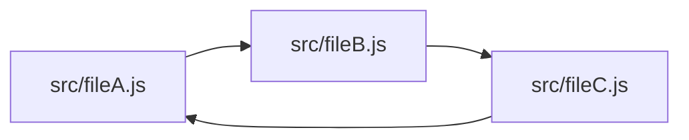

	

**skott** is a minimalist developer tool that can be used to efficiently generate directed graphs from your **JavaScript/TypeScript/Node.js** project. It can **automatically collect metadata** such as _file size_, _third-party_ or _builtin dependencies_, **detect circular dependencies** or help you **building tools relying on graph data structures** thanks to the exposed primitives. Many display modes exists (such as **embedded interactive web application** shown just below) but also other from the CLI **(.svg, .png, .md, .json)**.

	

**skott** exposes **directed graphs primitives** so that it can be used to implement tools on top of graph structures e.g. affected/incremental patterns as it exposes a way to know precisely and deeply dependencies for each graph node. More generally speaking, anything that can be implemented using graphs can be implemented using **skott**.

✅ Works for modern **JavaScript/TypeScript** projects (TSX/JSX, ECMAScript and CommonJS modules all supported). **TypeScript**'s path aliases are also supported.

✅ Works with any custom **dependency resolver** (useful for specific monorepos integration)

✅ Runs **incrementally** (experimental), meaning that Skott will _only analyze_ files that were modified/added since the last run, offering performance boosts.

✅ Deeply detects **circular dependencies** in an efficient way, with the ability to provide a max depth for the search

✅ Detect **unused npm third-party dependencies**

✅ Deeply **collect all dependencies of the project graph**

✅ Deep **parent and child dependencies traversals**

✅ Metadata collection for each traversed node (file size, view dependencies towards Node.js builtin modules and npm third-party libraries)

✅ Node.js binary and JSON modules are excluded by default

✅ Generate static files including raw JSON, [mermaid-js](https://github.com/mermaid-js/mermaid) diagrams (.svg, .png, .md) representing your project's graph directly generated from the CLI.

> **Note**
>
> **skott** can either build the project graph using an entrypoint file or build it starting from the current root directory and recursively traverse all directories/folders. Currently, supported files are **.js, .jsx, .cjs, .mjs, .ts, .tsx**. Some directories will be ignored by default, please check [the code](https://github.com/antoine-coulon/skott/blob/56fd0b3347ba5113be8d70bc07d09a4065e0b124/packages/skott/src/modules/walkers/ecmascript/module-resolver.ts#L93) to see more about that. 

## Why you should care about circular dependencies and dead code

1. **Circular (also known as cyclic) dependencies**

Let's start with an example of a simple circular dependency between three graph nodes:
> In the context of **skott**, nodes represent JavaScript files.

**What is the problem with cycles?**

Circular dependencies can make your program crash or introduce inconsistencies while modules are being loaded. [Node.js module systems](https://nodejs.org/api/modules.html) try to resolve circular dependencies using different approaches which are more or less successful. For example, [CommonJS](https://nodejs.org/api/modules.html#modules-commonjs-modules) can (due to its dynamic nature of resolving imports) [introduce inconsistencies when building the project graph](https://nodejs.org/api/modules.html#cycles).

If you're using [ECMAScript modules](https://nodejs.org/api/esm.html), you can consider yourself safe about module resolution inconsistencies mentioned above, mostly thanks to its static nature.

Nevertheless, cyclic dependencies at the file-level are sometimes choices but more often [code smells](https://en.wikipedia.org/wiki/Code_smell) revealing design misconceptions, so be sure to double check that.

2. **Dead code**

_Dead code_ can be defined as a code literally having no impact on the application, meaning that removing dead code should not alter in any way the behavior of the system. Some module bundlers such as [Rollup](https://rollupjs.org) and [Webpack](https://webpack.js.org) allow to delete some of the dead code [leveraging tree shaking](https://webpack.js.org/guides/tree-shaking). 

However, tree shaking is not an easy task and can mostly work with module systems using static-based imports/exports such as ECMAScript modules. To avoid removing code that appears to be used at runtime, module bundlers are being very precise about determining automatically chunks of code that can be safely removed. Module bundlers can also be helped by providing them manually clues about what can be safely removed e.g. `/*#__PURE__*/` for Webpack.

If you're not using tools implementing tree shaking, you will be able soon to use **skott**, which will bring up soon unused imports/exports warnings 🚀  

## Documentation

Please refer to the [documentation at the skott package level](https://github.com/antoine-coulon/skott/tree/main/packages/skott#readme)

## Graph Management

**skott** is powered by [digraph-js](https://github.com/antoine-coulon/digraph-js), a _0 dependency_ Node.js library to make Directed Graph construction and traversal effortless.

## Parsers

While traversing the project, **skott** automatically loads the appropriate parser required. When meeting **".js, .cjs, .mjs, .jsx"** files, a specific JS parser will be used, otherwise for **".ts, .tsx"** files
a specific TS parser will be used instead.

- JavaScript: JavaScript/JSX parsing is done using [meriyah](https://github.com/meriyah/meriyah)
- TypeScript: TypeScript/TSX parsing is done using [typescript-estree](https://github.com/typescript-eslint/typescript-eslint/tree/main/packages/typescript-estree)
